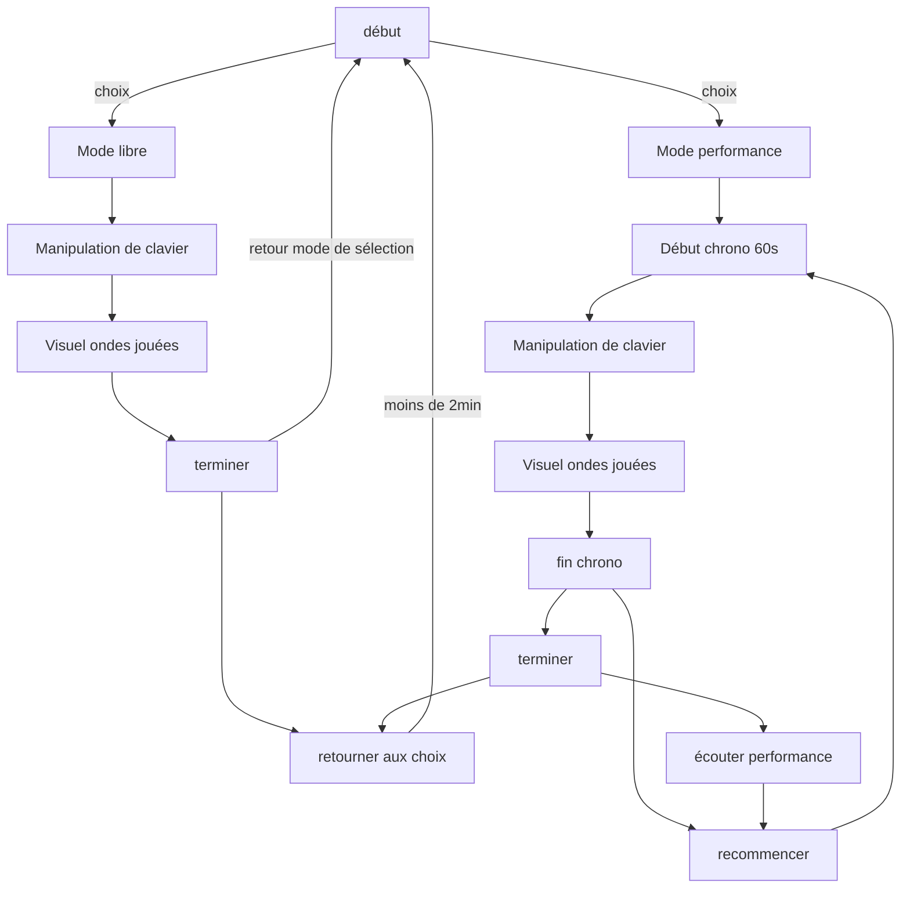

# Vizua - Planification

[Précédement Wave3D](https://jejed8.github.io/wave3d/)

## Concept 
L'expérience est une installation immersive où l'utilisateur joue sur un clavier MIDI et voit des visuels dynamiques se déployer autour de lui en réalité virtuelle. Chaque note déclenche des animations spectaculaires qui réagissent en temps réel, créant un spectacle audiovisuel captivant et interactif.

## Scénario interactif

## Devis

### Location / emprunt 
- Caque VR (oculus)
- Ordinateur (Étant capable de supporter les requis logiciel)
- Haut-Parleur Surround x4
- Console de son
- Clavier MIDI
- Chariot avec roulette pour la mobilité de l'installation
- Écran (moniteur) pour l'affichage de la vue en VR

## Synoptique

#### Entrée

- **Clavier MIDI** : Envoie des signaux MIDI au DAW.
- **DAW (Digital Audio Workstation)** :
  - Reçoit le signal MIDI.
  - Modifie les sons (EQ, effets, etc.).
  - Envoie les données audio/MIDI à PyTorch et à TouchDesigner.

#### Analyse AI

- **Framework PyTorch** :
  - Reçoit le signal audio/MIDI modifié du DAW.
  - Analyse le son (détection de motifs, classification d'émotions).
  - Envoie les résultats d'analyse à TouchDesigner via OSC/WebSocket.

#### Communication

- **OSC / WebSocket** :
  - Transporte les données d'analyse de PyTorch vers TouchDesigner en temps réel.
  - Synchronise les échanges de données entre le DAW, PyTorch et TouchDesigner.

#### Création Visuelle

- **TouchDesigner** :
  - Reçoit les données MIDI/audio et les résultats d'analyse de PyTorch.
  - Crée des visuels dynamiques basés sur les notes jouées et l'analyse AI.
  - Intègre des éléments 3D et de l'instancing pour des visuels complexes.

#### Rendu VR

- **OpenVR CHOP/TOP** :
  - Configure l'environnement de rendu stéréoscopique.
  - Relie les mouvements du casque VR et des contrôleurs à la caméra virtuelle et aux interactions visuelles.
- **Scène 3D** :
  - Adapte l'espace visuel pour l'immersion totale.
  - Synchronise les éléments visuels avec les mouvements et les interactions de l'utilisateur.

#### Interactions et Retours

- **Contrôleurs VR** :
  - Permettent à l'utilisateur de manipuler et interagir avec les visuels.
  - Envoient des signaux à TouchDesigner pour déclencher des animations ou modifier les éléments visuels.
- **Feedback visuel et haptique** :
  - Affiche des réponses visuelles et, si possible, des retours haptiques via les contrôleurs.

#### Résumé du Flux

**Clavier MIDI ➔ DAW ➔ Analyse par PyTorch ➔ Transmission OSC/WebSocket ➔ TouchDesigner ➔ Rendu VR (OpenVR).**

**Interaction utilisateur (contrôleurs) ➔ TouchDesigner ➔ Feedback en temps réel.**

### Liste des logiciels
| Logiciel             | Description Technique                                                                                  |
|----------------------|--------------------------------------------------------------------------------------------------------|
| TouchDesigner        | Génère des visuels interactifs et les rend en temps réel dans un environnement VR.                     |
| DAW (Ableton/Logic)  | Capture, modifie et traite les signaux MIDI/audio pour enrichir l'expérience sonore.                   |
| PyTorch              | Analyse les caractéristiques du son à l'aide de l'IA et transmet les données interprétées.            |
| OpenVR               | Permet l'intégration et le rendu stéréoscopique de la scène VR et gère le suivi des mouvements.        |
| OSC (Open Sound Control) | Protocole utilisé pour transmettre les données d'analyse et de contrôle en temps réel à TouchDesigner. |
| Oculus Software      | Établit la connexion et le suivi du casque Oculus avec le PC pour une immersion VR optimale.           |

## Plantation

